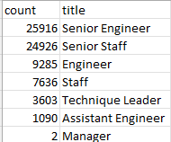

# Pewlett-Hackard-Analysis

## Overview
The purpose of this project was to determine the number of employees that may be arriving at retirement age so the company could prepare for a major shift in their labor force.  Additionally, the project identified the employees positioned to move into the retiree's roles who might benefit from a mentorship program. 

## Results
* There will be over 70,000 positions that may be vacated due to retirement.
* The department with the most retirements to prepare for is Engineering, with 25,916 Senior Engineers reaching retirement.
* Management is the least affected with only 2 positions set to retire.
* The majority of retirements may be coming from employees with Senior-level positions, including the Senior Engineers mentioned above and 24,926 Senior Staff positions

## Summary
* How many roles will need to be filled as the "silver tsunami" begins to make an impact?
The company should prepare to replace the following job titles:

* Are there enough qualified, retirement-ready employees in the departments to mentor the next generation of Pewlett Hackard employees?
There are 1,549 employees that qualify for the mentorship program.  If these employees are to be mentored by the retiring class of employees, the ratio is very favorable and there will certainly be enough retirees to mentor the up-and-coming staff.  
